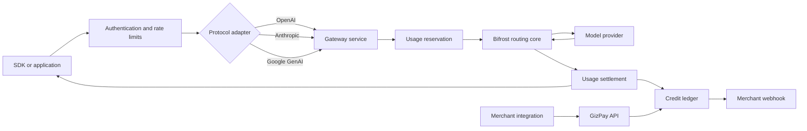

# Gizway public API architecture

The `api` directory owns Gizway's public contracts. Runtime handlers will live
under `internal/api`; Bifrost remains an embedded gateway implementation and is
not itself the public contract.

## Public surfaces

| Surface | Public base URL | Compatibility | Owner |
| --- | --- | --- | --- |
| AI Gateway | `https://api.gizway.com/v1` | OpenAI SDK and Realtime | Gateway adapter over Bifrost |
| Anthropic | `https://api.gizway.com/anthropic` | Anthropic SDK / Messages API | Gateway adapter over Bifrost |
| Google GenAI | `https://api.gizway.com/genai` | Google GenAI SDK | Gateway adapter over Bifrost |
| GizPay | `https://api.gizway.com/pay/v1` | Gizway payment contract | Gizway payment service |
| Account | `https://api.gizway.com/account/v1` | Gizway first-party apps | Gizway account service |
| Admin | `https://api.gizway.com/admin/v1` | Gizway internal operations | Gizway admin service |

The first three surfaces share the same model catalog, account, API-key,
routing, metering, and Credit charging pipeline. They differ only at the
protocol adapter.

## Public protocol boundary

Bifrost's native API and administrative routes are internal implementation
details. Gizway exposes only the three provider-compatible AI protocols plus
its own Account and GizPay contracts.

Gizway's canonical OpenAI-compatible route is `/v1`, so users can configure the
normal OpenAI base URL:

```text
OPENAI_BASE_URL=https://api.gizway.com/v1
```

Anthropic cannot use that route because its request and response schema is
different. The Anthropic SDK instead uses:

```text
ANTHROPIC_BASE_URL=https://api.gizway.com/anthropic
```

## Request pipeline



## Contract boundaries

### AI Gateway API

The public contract includes:

- `/v1/models`
- `/v1/chat/completions`
- `/v1/responses`
- `/v1/embeddings`
- `/v1/audio/*`
- `/v1/images/*`
- `/v1/realtime` over WebSocket
- `/v1/realtime/calls` for WebRTC SDP exchange
- `/v1/realtime/client_secrets`
- `/v1/realtime/sessions`

Bifrost administrative, provider-key, governance, plugin, and internal health
routes are never exposed directly.

### Anthropic API

The public contract includes Anthropic-compatible routes below `/anthropic`,
starting with:

- `/anthropic/v1/messages`
- `/anthropic/v1/messages/batches`
- `/anthropic/v1/models`
- `/anthropic/v1/files`

The same Gizway API key is accepted, but authentication headers are normalized
at the edge.

### GizPay API

The initial merchant contract includes:

- `POST /pay/v1/payment_intents`
- `GET /pay/v1/payment_intents/{id}`
- `POST /pay/v1/payment_intents/{id}/confirm`
- `POST /pay/v1/payment_intents/{id}/cancel`
- `GET /pay/v1/transactions`
- `POST /pay/v1/webhook_endpoints`

Merchant-owned Payment API operations use payment-scoped API keys and
idempotency keys. Payer checkout retrieval/confirmation uses a User session and
must explicitly override the merchant security scheme. Neither path accepts
provider credentials or exposes ledger mutation primitives.

Merchant payment reversal is an explicit full compensating posting under
`POST /pay/v1/payment_intents/{payment_intent_id}/reversals`. It leaves the
original payment and ledger transaction immutable and is distinct from an
original-route top-up refund.

### Account API

This API is for Gizway's website, desktop, and mobile applications. It manages
profile, API keys, balances, top-ups, original-route refunds, transfers,
usage, merchants, and transaction history. PowerSync carries client-safe
read projections; commands still go through this API.

### Admin API

The internal Admin API manages users, merchant review, providers, endpoints,
models, variants, versioned prices, API-key revocation, usage diagnostics,
payments, ledger corrections, webhook delivery, and audit queries. Every write
is authenticated, authorized, idempotent where applicable, and audited.

Admin authentication is deliberately flat: active administrator accounts have
the same authority and can use either a web login session or an Admin API Key.
Admin keys are stored separately from customer Gateway and payment keys.

## Authentication and key scopes

Customer API keys use one physical format, but every key has an explicit kind
and allowlisted scopes. User and Admin browser sessions and Realtime client
secrets are separate credential formats and lifecycles.

| Scope | Permits |
| --- | --- |
| `gateway:invoke` | AI inference and Realtime sessions |
| `gateway:usage:read` | Usage and cost queries |
| `pay:intents:write` | Create and manage merchant payment intents |
| `pay:transactions:read` | Read merchant transactions |
| `pay:webhooks:write` | Configure merchant webhooks |
| `account:self` | First-party account operations |

Gateway and payment keys should normally be separate even when they belong to
the same user.

| Credential class | Surface |
| --- | --- |
| User session | Account API and payer checkout/confirmation |
| Gateway API Key | Provider-compatible AI APIs and scoped usage reads |
| Payment API Key | Merchant-owned GizPay operations |
| Admin session or Admin API Key | Admin API |
| Realtime client secret | One constrained Realtime session |

Each OpenAPI operation references its exact security scheme. In particular, a
merchant Payment key cannot confirm a payment as the payer, and a User session
cannot create an intent as a merchant.

## Versioning

- Protocol-compatible AI APIs follow the upstream protocol version expressed
  by their path and headers.
- GizPay and Account APIs use explicit path versions (`/pay/v1`,
  `/account/v1`).
- Additive fields are backward compatible. Removing or changing field meaning
  requires a new major path version.
- Bifrost routes are implementation details and may change without changing
  the Gizway public contract.

## Contract files

```text
api/
├── README.md
└── openapi/
    ├── common.yaml    # Shared Gizway-owned schemas
    ├── payment.yaml   # Public GizPay merchant API
    ├── account.yaml   # First-party app API
    └── admin.yaml     # Internal operations API
```

The OpenAI, Anthropic, and Google provider schemas should be referenced or
generated from their upstream contracts rather than copied and manually
maintained in full.
